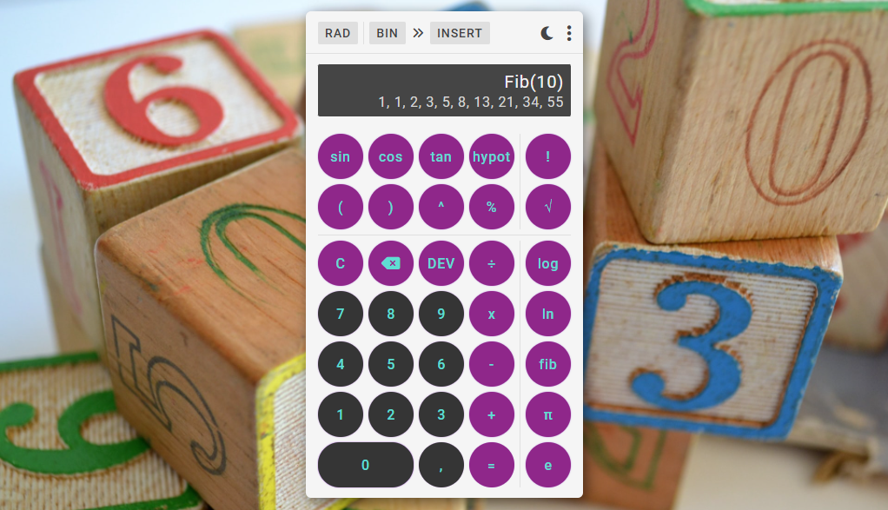

<div align="center">
  <div>
    <h1>DevCalc</h1>
    
    <h3>
      🧮 Uma aplicação JavaScript Vanilla para realização de cálculos matemáticos, de diferentes níves de complexidade, comuns entre desenvolvedores de software
    </h3>
  </div>

  <p>
    <a href="#-sobre-o-projeto">Sobre o projeto</a> •
    <a href="#-status">Status</a> •
    <a href="#-features">Features</a> • 
    <a href="#%EF%B8%8F-pré-requisitos">Pré-requisitos</a> • 
    <a href="#-tecnologias-utilizadas">Tecnologias utilizadas</a> • 
    <a href="#-autor">Autor</a> •
    <a href="#-readme-versions">README versions</a>
  </p>

  <div>
    <a href="https://my-devcalc.netlify.app/">
      
    </a>
    
    
  </div>
</div>

<hr>

### 🎯 Sobre o projeto

<p>
  A DevCalc é, essencialmente, uma calculadora "para desenvolvedores" que, além de ser visualmente customizável, permitindo a criação de temas personalizados, se propõe a fornecer desde cálculos matemáticos básicos até alguns mais complexos, como Sequência de Fibonacci, Funções Trigonométricas e operações que envolvem o uso de parênteses, tudo para prover uma melhor experiência ao usuário que está em constante contato com o mundo da matemática.
</p>

<hr>

### 🏁 Status

<h3 align="center">
  🎉 DevCalc ✔️ Finalizado 🎉
</h3>

<hr>

### 🏆 Features

#### Geral

- [x] Adicionar atalhos para controle da aplicação a partir do teclado;
- [x] Alternar entre os temas da aplicação, incluindo o tema personalizado;
- [x] Abrir caixa de opções;
- [x] Lidar com conflitos de inserção;
- [x] Formatar o número atual;
- [x] Diminuir / aumentar o tamanho da fonte com base no comprimento da expressão;
- [x] Notificar o usuário sobre expressões inválidas;
- [x] Limpar a expressão;
- [x] Apagar último caractere da expressão;
- [x] Ampliar o resultado;
- [x] Guardar, quando o resultado for ampliado, a expressão e o resultado atual, caso ambos sejam válidos, no histórico da aplicação;
- [x] Ativar / desativar o "modo de desenvolvedor", o qual habilita a inserção e, posteriormente, o cálculo de operadores unários e funções matemáticas; e
- [x] Alternar entre os tipos de conversão de bases númericas da aplicação.

#### Relacionadas aos cálculos

- [x] Adicionar números à expressão;
- [x] Restringir, para uma, a quantidade de vírgulas que podem ser adicionadas à um número;
- [x] Adicionar operadores à expressão;
- [x] Executar a regra de sinais quando um operador for adicionado à frente de outro e substituir ambos pelo operador resultante;
- [x] Adicionar operadores unários e funções matemáticas à expressão;
- [x] Adicionar conversão de base númerica à expressão;
- [x] Mudar a unidade de medida a ser utilizada como base para o resultado de cálculos de Funções Trigonométricas;
- [x] Calcular e exibir o resultado de expressões válidas em tempo real; e
- [x] Estabelecer hierarquia de priorização de cálculos.

#### Relacionadas aos modais

- [x] Permitir que o usuário transite entre todos os modais, por meio dos atalhos, sem que haja conflitos de visualização;
- [x] Abrir modal de histórico, que armazena expressões e resultados anteriores agrupados por data;
- [x] Abrir modal de atalhos, que apresenta ao usuário todos os atalhos da aplicação;
- [x] Abrir modal de personalização, que permite que o usuário crie, por meio de uma tabela descritiva, um tema personalizado;
- [x] Recuperar as cores atuais da aplicação e exibi-las nos campos da coluna "Cor atual", presente na tabela de personalização;
- [x] Copiar, em caso de duplo clique em um campo da coluna "Cor atual", o valor da cor atual para o campo correspondente na coluna "Nova cor";
- [x] Limpar novas cores, o que atribui o valor padrão (preto) para todos os campos da coluna "Nova cor";
- [x] Visualizar tema personalizado;
- [x] Salvar tema personalizado; e
- [x] Fechar modal atual.

<hr>

### ❗️ Pré-requisitos

Fala Dev, beleza? Antes de iniciar seus testes e/ou contribuições na aplicação, é necessário ter o nosso maravilhoso [GIT](https://git-scm.com) instalado, bem como, um bom editor de texto.

Bom, com tudo instalado e pronto, podemos ir para o passo a passo de como rodar a aplicação.

### 🕹️ Rodando a aplicação

```bash
# Primeiramente, clone este repositório com o GIT
$ git clone <https://github.com/ThiagoBrito-Dev/devcalc>

# Acesse a pasta do projeto pelo terminal de comando
$ cd .../devcalc

# E, para finalizar, abra o arquivo "index.html" no seu navegador, ou ainda, utilizando a extensão Live Server, caso você a tenha instalada.
```

<hr>

### 🔮 Tecnologias utilizadas

- [HTML](https://devdocs.io/html/)
- [CSS](https://devdocs.io/css/)
- [JavaScript](https://devdocs.io/javaScript/)

<hr>

### 👨🏽‍🎓 Autor

<div align="center">
  

  <br />

  <div>
    <h3>
      🤝 Thiago Raniery Brito
    </h3>
    <p>E aí Dev, gostou da aplicação? Bom, se quiser, fique à vontade para entrar em contato comigo por aqui ou pelas tags abaixo.</p>
  </div>
  
  <div>
    <a href="https://www.linkedin.com/in/thiagoranierybrito/">
      
    </a>
    <a href="mailto:thiagobritotrs@gmail.com">
      
    </a>
  </div>
</div>

<hr>

### 📚 README versions

<div>
  <a href="https://github.com/ThiagoBrito-Dev/devcalc/blob/main/README.md">Portuguese (pt-br)</a>
  |   
  <a href="https://github.com/ThiagoBrito-Dev/devcalc/blob/main/README-en.md">English (en-us)</a>
</div>
